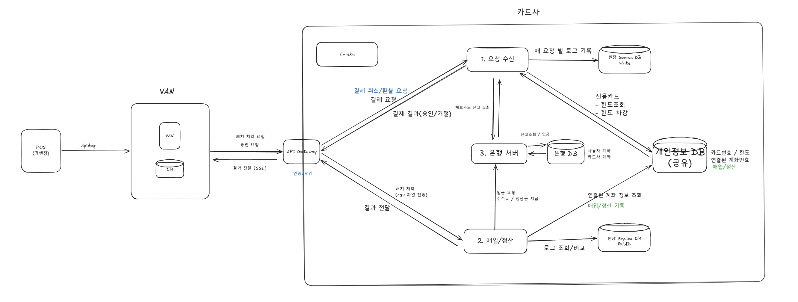
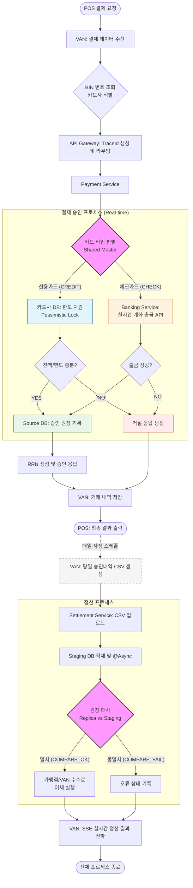

# 💳 FISA 카드 결제 시스템 (FISA Card Payment System)

카드사 결제 시스템 시뮬레이터입니다.
POS 단말기의 결제 요청을 VAN이 수신하고, 카드사 내부 서비스를 통해 승인 및 정산까지 처리하는 전체 카드 결제 파이프라인을 구현합니다.

---

## 📑 목차

1. [프로젝트 개요](#1-프로젝트-개요)
2. [시스템 아키텍처 및 서비스 구성](#2-시스템-아키텍처-및-서비스-구성)
3. [전체 흐름](#3-전체-흐름)
4. [핵심 비즈니스 로직](#4-핵심-비즈니스-로직)
5. [금융 도메인 적용 및 고려 사항](#5-금융-도메인-적용-및-고려-사항)
6. [기술 스택](#6-기술-스택)
7. [관련 문서 및 참고자료](#7-관련-문서-및-참고자료)

---

## 1. 프로젝트 개요

실제 카드 결제 인프라의 주요 구성요소를 MSA(Microservice Architecture)로 구현한 시뮬레이터입니다.

| 구성 요소 | 담당 역할 및 업무 |
|-----------|------------------------------------------------------|
| **VAN** | POS 결제 요청 수신 및 분기(Routing), 정산 데이터(CSV) 생성 및 전송 |
| **API Gateway** | 서비스 진입점, 통합 라우팅, Trace-ID 기반 트래킹 제공 |
| **Payment Service** | 결제 승인 처리 (신용카드: 한도 제어 / 체크카드: 실시간 출금 연동) |
| **Settlement Service** | 정산 파일 수신, 원장 대사, 가맹점/VAN 정산금 입금 |
| **Banking Service** | 계좌 출금, 이체 처리 및 잔액 관리 시뮬레이션 |
| **Eureka Server** | 서비스 디스커버리(Service Discovery) 및 분산 환경 상태 관리 |

---

## 2. 시스템 아키텍처 및 서비스 구성



### 2-1. 서비스 포트 정보

| 서비스명 | 내부 포트 | 호스트 포트 | 주요 기능 |
|--------|----------|------------|----------|
| **Eureka Server** | 8761 | 8761 | 서비스 상태 관리 및 검색 |
| **API Gateway** | 8080 | 8080 | 공통 진입점 및 라우팅 |
| **VAN** | 8081 | 8081 | 결제 중계 및 배치 처리 |
| **Payment Service** | 8082 | - | 실시간 결제 승인 로직 |
| **Settlement Service** | 8084 | - | 비동기 정산 및 대사 로직 |
| **Banking Service** | 8083 | - | 가상 은행 거래 처리 |

### 2-2. 데이터베이스 구성

| DB 컨테이너 | 용도 | 호스트 포트 | 담당 서비스 |
|------------|------|-----------|-----------|
| **card-source-db** | 결제 승인 원장 (Write) | 3311 | Payment Service |
| **card-shared-db** | 마스터 정보 및 정산 스테이징 | 3312 | Payment / Settlement |
| **card-replica-db** | 정산 대사용 원장 (Read) | 3313 | Settlement Service |
| **bank-db** | 은행 계좌 및 이체 로그 | 3314 | Banking Service |
| **van-db** | VAN 고유 거래 내역 및 BIN | 3307 | VAN Service |

### 2-3. 네트워크 구성
[card-net]
  eureka-server, api-gateway, payment-service, settlement-service, banking-service
  card-source-db, card-shared-db, card-replica-db, bank-db

[van-net] (VAN 레포)
  van, van-db


---

## 3. 전체 흐름



---

## 4. 핵심 비즈니스 로직

### 4-1. 결제 승인 프로세스 (`payment-service`)

**카드 타입 분기**

BIN 테이블(VAN) 또는 `card_master` (shared DB)를 통해 카드 타입을 판별하고 처리 경로를 분기합니다.

| 구분 | 신용카드 (CREDIT) | 체크카드 (CHECK) |
|------|-----------------|----------------|
| 잔액/한도 확인 | `card_master.credit_limit - used_amount` | `bank_accounts.balance` |
| 동시성 제어 | Pessimistic Lock (한도 차감) | Banking Service에 출금 위임 |
| 은행 호출 | 없음 | `POST /api/bank/withdraw` |
| 원장 기록 | `ledger_source.card_ledger` | `ledger_source.card_ledger` |

**RRN 생성**

카드사(Payment Service)가 12자리 HEX 문자열로 생성하여 응답에 포함합니다. (ISO 8583 표준)

**응답 코드**

| 코드 | 의미 |
|------|------|
| `00` | 승인 |
| `99` | 거절 |

---

### 4-2. 정산 배치 (`VAN` → `settlement-service`)

**Spring Batch 구조 (VAN)**

```
AcquisitionItemReader  →  van_transactions에서 당일 APPROVED 조회
AcquisitionItemProcessor → VanTransaction → CSV 한 줄 변환 + 카드번호 마스킹
AcquisitionItemWriter  →  CSV 파일 생성 → multipart POST 전송
```

- `chunk(100)`: 100건 단위 처리, 중간 실패 시 해당 chunk부터 재시작
- 스케줄: `@Scheduled(cron = "0 0 0 * * *")` — 매일 자정

**원장 대사 (settlement-service)**

```
1. van_settlement_staging 전체 로드
2. RRN + STAN 중복 확인
3. (rrn, stan)으로 ledger_replica.card_ledger 조회
4. 금액 / 가맹점 ID / 승인번호 / 카드번호 비교
5. 불일치 → COMPARE_FAIL, 전체 일치 → COMPARE_OK
```

**수수료 계산 공식**

```
수수료(fee)       = amount × fee_rate  (HALF_UP 반올림)
가맹점 입금액      = amount - fee
VAN 수수료        = fee ÷ 2
```

---

### 4-3. SSE (Server-Sent Events) — 정산 결과 알림

정산 처리가 완료되면 `settlement-service`가 VAN에 HTTP POST를 전송하고, VAN은 SSE 구독 중인 클라이언트에게 이벤트를 전파합니다.

| statusCode | 의미 |
|------------|------|
| `SUCCESS` | 대사 및 정산 입금 완료 |
| `COMPARE_FAILED` | CSV ↔ 원장 대조 불일치 |
| `SETTLEMENT_FAILED` | 대사 성공 후 은행 이체 실패 |
| `PROCESSING_FAILED` | 비동기 처리 중 예외 발생 |

---

## 5. 금융 도메인 적용 및 고려 사항

### 5-1. ISO 8583 메시지 규격 준수

금융 및 결제 도메인에서 표준으로 사용되는 메시지 규격을 차용하였습니다.

| 필드명 (DE) | 설명 | 프로젝트 적용 데이터 |
|:---:|---|---|
| **DE02** | 카드번호 (Primary Account Number) | `cardNumber` |
| **DE04** | 거래 금액 | `amount` |
| **DE11** | 거래 추적 일련번호 (STAN) | `stan` |
| **DE37** | 거래 참조 번호 (RRN) | `rrn` |
| **DE39** | 응답 코드 (Response Code) | `responseCode` |

### 5-2. 정산 방식: DDC(Data Draft Capture) 구조

가장 보편적인 VAN 정산 방식인 DDC 구조를 차용하였습니다.

| 방식 | 대상 가맹점 | 데이터 주체 | 특징 |
|:---:|---|:---:|---|
| **DDC (선정)** | 중소 가맹점 (편의점 등) | VAN | VAN사가 데이터를 취합하여 카드사별 CSV 전송 |
| **DESC** | 서명 필요 가맹점 | VAN | 전자 서명 이미지 전송 및 전표 수거 생략 |
| **EDI** | 대형 가맹점 (백화점 등) | 가맹점 | 가맹점이 자체 정산 파일을 생성하여 VAN은 중계만 수행 |

### 5-3. 기술적 고려사항

*   **SFTP vs HTTP Multipart**: 실제 업무에서는 보안을 위해 SFTP를 주로 사용하나, 본 프로젝트에서는 구현 편의성을 위해 HTTP Multipart/form-data 방식을 채택하였습니다.
*   **SSE 도입 요구사항**: 결제 정산 프로세스는 대량 처리가 수반되는 긴 작업이므로, Polling 방식 대신 서버 푸시(SSE)를 통해 완료 시점을 효율적으로 알리도록 설계하였습니다.

---

## 6. 기술 스택

| 서비스 | Java | Spring Boot | 주요 의존성 |
|--------|------|-------------|------------|
| VAN | 17 | 3.5.x | Spring Batch, Spring Data JPA, Eureka Client |
| API Gateway | 17 | 3.5.x | Spring Cloud Gateway (MVC), Eureka Client |
| Payment Service | 17 | 3.5.x | Spring Data JPA, Eureka Client |
| Settlement Service | 17 | 3.5.x | Spring JDBC, RestClient, @Async, Eureka Client |
| Banking Service | 17 | 3.5.x | Spring Data JPA, Eureka Client |
| Eureka Server | 17 | 3.5.x | Spring Cloud Netflix Eureka Server |

**공통:** MySQL 8.0, Docker, Gradle

---

## 7. 관련 문서 및 참고자료

### 🔎 상세 문서
*   [🛠️ DB 구조 및 상세 ERD](./docs/detailERD.md)
*   [📑 Payment Service ](./docs/PAYMENT.md)
*   [📑 Settlement Service ](./docs/SETTLEMENT.md)
*   [📑 Banking Service ](./docs/BANK.md)
*   [📑 VAN ](https://github.com/fisa-card-payment/fisa-van/blob/main/VAN_%EB%A1%9C%EC%A7%81_%EB%AC%B8%EC%84%9C.md)
*   [🖇️ Eureka ](./docs/EUREKA.md)
*   [🖇️ Gateway ](./docs/APIGATEWAY.md)
*   [🚀 실행 방법](./docs/how2Run.md)

### 📚 외부 참조 지표
*   **관련 법령**: [여신전문금융업법 (신용카드업)](https://law.go.kr/lsLinkCommonInfo.do?lsJoLnkSeq=1022614019)
*   **VAN 서비스**: [KOCES VAN 서비스 흐름](https://koces.co.kr/business/service_van.php)
*   **금융 표준**: [ISO 8583 메시지 포맷의 이해](https://connieya.github.io/understanding-iso-8583/)
*   **실제 서비스**: [KFTC(금융결제원) 정산 서비스 안내](https://www.kftcvan.or.kr/guide/service/creditCard.do?tab=03)
