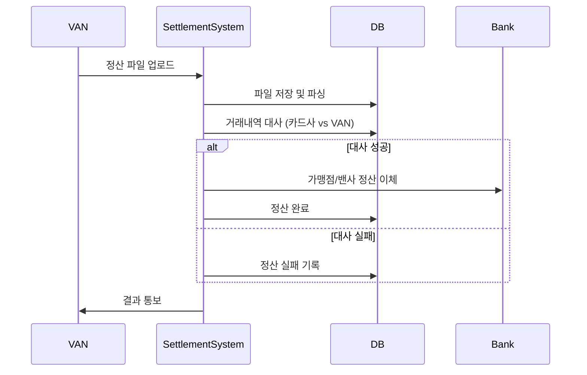
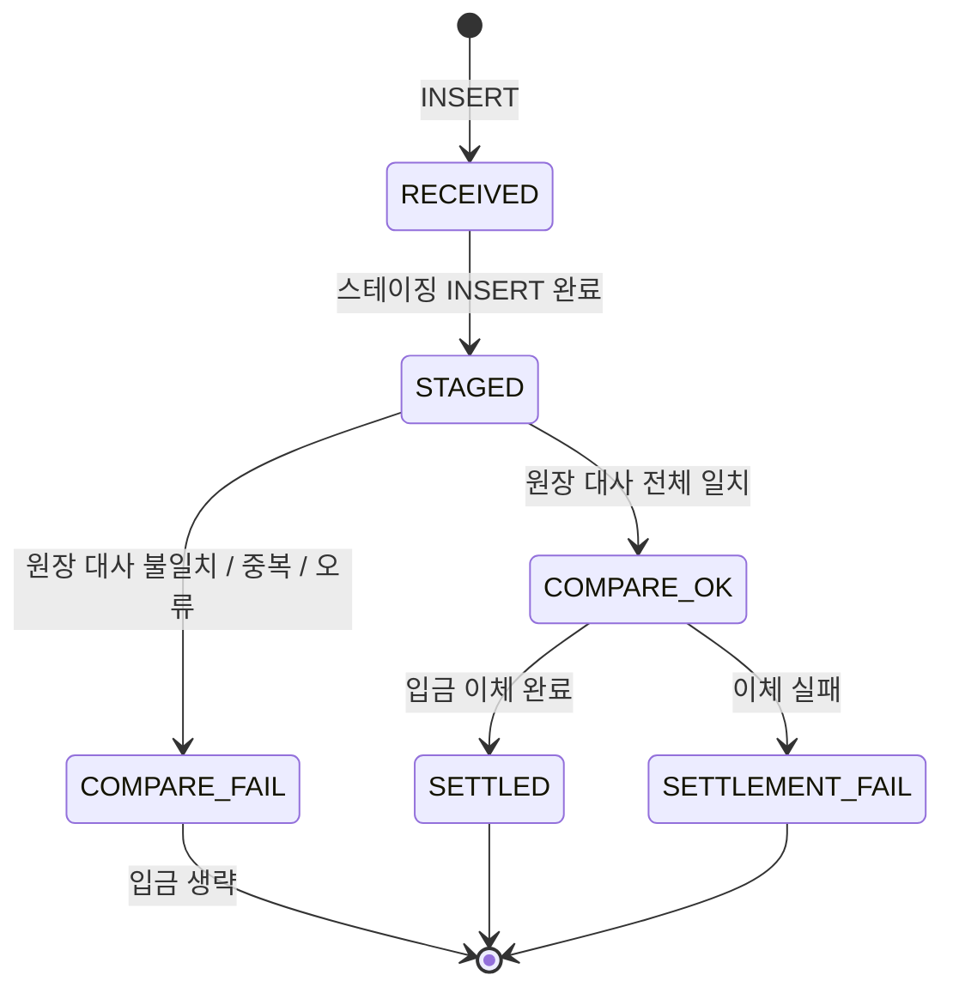

# 🌠settlement-service

> VAN이 전송한 정산용 CSV를 수신하고, 원장(Replica DB) 대사 → 은행 이체 → VAN SSE 알림을 처리합니다.

---

## 목차

1. [개요](#1-개요)
2. [기술 스택](#2-기술-스택)
3. [아키텍처 / 전체 흐름](#3-아키텍처--전체-흐름)
4. [API 명세](#4-api-명세)
5. [처리 단계 1 — CSV 수신 & 스테이징](#5-처리-단계-1--csv-수신--스테이징)
6. [처리 단계 2 — 원장 대사](#6-처리-단계-2--원장-대사)
7. [처리 단계 3 — 수수료 계산 & 정산 입금](#7-처리-단계-3--수수료-계산--정산-입금)
8. [클라이언트 — BankTransferClient](#8-클라이언트--banktransferclient)
9. [클라이언트 — VanBatchResultNotifier & SSE](#9-클라이언트--vanbatchresultnotifier--sse)
10. [데이터베이스](#10-데이터베이스)
11. [빌드 & 실행](#11-빌드--실행)

---

## 1. 개요

`settlement-service`는 카드 결제 정산 서비스의 카드 로직 입니다..

### 역할

| 단계 | 내용 |
|------|------|
| 수신 | VAN으로부터 정산 CSV 파일을 HTTP multipart로 수신 |
| 스테이징 | 파일을 저장하고 shared DB에 행 단위로 적재 |
| 원장 대사 | 스테이징 데이터를 원장 데이터 (ledger_replica의 `card_ledger`)와 비교 |
| 정산 입금 | 대사 성공 시 가맹점/VAN에게 banking-service를 통해 이체 |
| 알림 | 처리 결과를 VAN 서버에 전달 (SSE) |

### 연동 서비스

```
VAN 서버 ──POST CSV──▶ settlement-service ──POST /api/bank/transfer──▶ banking-service
                                │
                                └──POST /api/van/sse/batch-result──▶ VAN 서버 (SSE 트리거)
```

| 서비스 | 연동 목적 |
|--------|-----------|
| `banking-service` (`:8083`) | 가맹점·VAN 계좌로 이체 실행 |
| `van` | 배치 처리 결과 알림 (SSE) |

---

## 2. 기술 스택

| 항목 | 내용 |
|------|------|
| Language | Java 17 |
| Framework | Spring Boot 3.5 |
| Build | Gradle |
| DB 접근 | Spring JDBC |
| DB | MySQL 8 × 2개 (shared_master, ledger_replica) |
| HTTP Client | `RestClient` |
| Service Discovery | Spring Cloud Netflix Eureka Client |
| 기타 | Lombok, `@Async` |

---

## 3. 아키텍처 / 전체 흐름



### 동기 vs 비동기 구간

| 구간 | 처리 방식 | 내용 |
|------|-----------|------|
| HTTP 요청 수신 ~ 스테이징 완료 | **동기** | VAN에 즉시 200 응답 반환 |
| 원장 대사 → 입금 → VAN 알림 | **비동기 (`@Async`)** | 별도 스레드 풀에서 실행 |

---

## 4. API 명세

### `POST /api/settlement/upload`

VAN 서버에서 정산 CSV를 업로드하는 엔드포인트입니다.

**Request**

| 항목 | 값 |
|------|----|
| Method | `POST` |
| URL | `/api/settlement/upload` |
| Content-Type | `multipart/form-data` |

| 파라미터 | 타입 | 필수 | 설명 |
|----------|------|------|------|
| `file` | `MultipartFile` | ✅ | 정산 CSV 파일 (`.csv` 확장자만 허용) |
| `batchDate` | `String` | ✅ | 정산 배치 날짜 (`yyyy-MM-dd` 형식) |


**Response — 성공 (200)**

```json
{
  "fileName": "settlement_20240101.csv",
  "message": "CSV 파일 수신 및 정산 처리가 시작되었습니다.",
  "status": "SUCCESS"
}
```

> 여기서의 응답은 CSV 파일을 잘 받았음을 의미합니다. 정산 결과는 뒤에 전달됩니다.

**Response — 실패 (400) 또는 서버 오류 (500)**

```json
{
  "status": "FAIL",
  "message": ",,,,,,"
}
```

---

## 5. 처리 단계 1 — CSV 수신 & 스테이징

### 관련 클래스

| 클래스 | 역할 |
|--------|------|
| `SettlementController` | HTTP 진입점, 검증, 스테이징 호출, 비동기 트리거 |
| `VanCsvReceiveService` | 디스크 저장 + shared DB 트랜잭션 처리 |
| `SettlementService` | CSV 파일 파싱 |

### 처리 흐름

1. **파일 검증** (`SettlementController`)
   - `batchDate` 형식 검증 (`\d{4}-\d{2}-\d{2}`)
   - 파일 비어있음 여부, `.csv` 확장자 여부 확인

2. **디스크 임시 저장** (`VanCsvReceiveService`)
   - 저장 경로: `{settlement.van-upload.temp-dir}/{UUID}_{원본파일명}`
   - 경로 순회 공격 방지: `..` 포함 파일명 거부

3. **CSV 파싱** (`SettlementService.parseCsvFile`)
   - 첫 번째 행(헤더) 스킵, 빈 행 스킵
   - 결과: `List<VanCsvRow>` (줄 번호 포함)

4. **스테이징 배치 INSERT**
   - `van_settlement_staging`에 `JdbcTemplate.batchUpdate`로 일괄 INSERT

5. **상태 갱신**
   - `van_settlement_file` → `status = STAGED`, `row_count = N`

6. **비동기 트리거**
   - `SettlementAsyncProcessor.continueAfterStaging(fileId, batchDate)` 호출 후 즉시 HTTP 200 반환

### 트랜잭션 경계

`VanCsvReceiveService.receiveAndStage`는 `@Transactional(transactionManager = "sharedTransactionManager")`으로 묶여 있습니다. 디스크 저장 ~ 스테이징 INSERT ~ 상태 갱신이 하나의 트랜잭션입니다.

---

## 6. 처리 단계 2 — 원장 대사

### 관련 클래스

| 클래스 | 역할 |
|--------|------|
| `SettlementAsyncProcessor` | `@Async` 비동기 오케스트레이터 |
| `LedgerReconciliationService` | 스테이징 ↔ card_ledger 건별 대사 |

### 비교 절차

```
1. van_settlement_staging 전체 로드 (file_id 기준)
2. RRN + STAN 중복 여부 확인 → 중복 시 즉시 COMPARE_FAIL
3. (rrn, stan) 묶음으로 card_ledger 일괄 조회 (replica DB)
4. 건별 비교:
   - 금액 (amount)
   - 가맹점 ID (merchant_id)
   - 승인번호 (approval_code)
   - 카드번호 (마스킹 처리 된 부분을 제외한 앞 뒤 비교)
5. 불일치 항목이 하나라도 있으면 COMPARE_FAIL + error_message 기록
6. 전체 일치 시 COMPARE_OK
```

### 결과

| 결과 | `van_settlement_file.status` |
|------|------------------------------|
| 전체 일치 | `COMPARE_OK` |
| 중복/불일치/원장 없음 | `COMPARE_FAIL` + `error_message` |

---

## 7. 처리 단계 3 — 수수료 계산 & 정산 입금

### 관련 클래스

| 클래스 | 역할 |
|--------|------|
| `SettlementPayoutService` | 수수료 계산 및 이체 실행 |
| `SettlementBankProperties` | 카드사·VAN 계좌번호 |

### 실행 조건

`van_settlement_file.status == COMPARE_OK`인 경우에만 실행합니다. 대사 실패(`COMPARE_FAIL`) 시에는 입금 단계를 생략합니다.

### 수수료 계산 공식

```
fee        = amount × fee_rate        (HALF_UP 반올림)
merchantPay = amount - fee             (가맹점 입금액)
vanShare   = fee ÷ 2                  (VAN 수수료 분배)
```

**예시** (`amount = 10,000원`, `fee_rate = 0.0200` (2%))

| 항목 | 계산 | 결과 |
|------|------|------|
| 수수료 (fee) | 10,000 × 0.02 | 200원 |
| 가맹점 입금액 (merchantPay) | 10,000 - 200 | 9,800원 |
| VAN 수수료 (vanShare) | 200 ÷ 2 | 100원 |

### 이체 흐름

```
카드사 계좌 (9000-0001)
    │
    ├──▶ 가맹점 정산 계좌 (merchant_master.settle_account):  merchantPay 원
    │
    └──▶ VAN 계좌 (9000-0002):  vanShare 원
```

### 예외 처리

| 상황 | 동작 |
|------|------|
| `merchant_master`에 없는 `merchant_id` 포함 | 즉시 `SETTLEMENT_FAIL` |
| `settle_account`가 빈 문자열 | `BankTransferException` 발생 → `SETTLEMENT_FAIL` |
| `merchantPay ≤ 0` | `BankTransferException` 발생 → `SETTLEMENT_FAIL` |
| 이체 API 호출 실패 | `BankTransferException` 발생 → `SETTLEMENT_FAIL` |

---

## 8. 클라이언트 — BankTransferClient

### 역할

`banking-service`의 이체 API를 호출하여 실제 계좌 간 금액을 이동시킵니다.

### 설정

```yaml
service:
  bank-url: http://banking-service:8083
```

`BankRestClientConfig`에서 `RestClient` 빈(`bankRestClient`)을 `bank-url`로 등록합니다.

### API 호출

```
POST {service.bank-url}/api/bank/transfer
Content-Type: application/json
```

**요청 DTO** (`BankTransferApiRequest`)

```json
{
  "fromAccount": "9000-0001",
  "toAccount":   "2001-0001",
  "amount":      9800
}
```

| 필드 | 설명 |
|------|------|
| `fromAccount` | 출금 계좌 (카드사 정산 계좌) |
| `toAccount` | 입금 계좌 (가맹점 또는 VAN 계좌) |
| `amount` | 이체 금액 (원) |

**응답 DTO** (`BankTransferApiResponse`)

banking-service의 이체 결과를 담습니다.

---

## 9. 클라이언트 — VanBatchResultNotifier & SSE

### 역할

정산 파이프라인(대사 + 입금)이 완료되면 VAN 서버에 결과를 HTTP POST로 전송합니다. VAN 서버는 이 요청을 받아 SSE 구독 중인 클라이언트에게 이벤트를 전파합니다.

```
settlement-service
    └──POST /api/van/sse/batch-result──▶ VAN 서버
                                              └──SSE push──▶ 브라우저/구독 클라이언트
```

### 설정

```yaml
settlement:
  van-sse:
    enabled: true
    base-url: http://host.docker.internal:8081
```

### API 호출

```
POST {settlement.van-sse.base-url}/api/van/sse/batch-result
Content-Type: application/json
```

**요청 DTO** (`BatchResultDto`)

```json
{
  "batchDate":  "2024-01-01",
  "statusCode": "SUCCESS",
  "message":    "대사 및 정산 입금이 완료되었습니다."
}
```

### BatchStatusCode

| 코드 | 의미 | 발생 조건 |
|------|------|-----------|
| `SUCCESS` | 대사·입금 완전 성공 | `COMPARE_OK` + `SETTLED` |
| `COMPARE_FAILED` | 원장 대사 실패 | `COMPARE_FAIL` |
| `SETTLEMENT_FAILED` | 입금 단계 실패 | `COMPARE_OK` + `SETTLEMENT_FAIL` |
| `PROCESSING_FAILED` | 비동기 처리 중 예외 | `@Async` 내 예외 발생 |

---

## 10. 데이터베이스

### 사용 DB 목록

| DB 이름 | 용도 | 트랜잭션 매니저 |
|---------|------|----------------|
| `shared_master` | 정산 파일 추적, 스테이징, 가맹점 정보 | `sharedTransactionManager` |
| `ledger_replica` | 원장 대사 기준 데이터 (Read-Only) | `replicaTransactionManager` (@Primary) |

---

### shared_master — `van_settlement_file`

#### `status` 상태 전이



| 상태 | 의미 |
|------|------|
| `RECEIVED` | 파일 받은 직후 |
| `STAGED` | CSV 행 전체 스테이징 완료 |
| `COMPARE_OK` | 원장 대사 일치 |
| `COMPARE_FAIL` | 원장 대사 실패 |
| `SETTLED` | 입금 이체까지 완료 |
| `SETTLEMENT_FAIL` | 대사 성공 후 이체 실패 |


---

## 11. 빌드 & 실행

### 로컬 실행

```bash
# 빌드
./gradlew build

# 실행 (기본 포트: 8084)
./gradlew bootRun

# 환경 변수 지정 실행 예시
DB_REPLICA_URL=jdbc:mysql://localhost:3313/ledger_replica?allowPublicKeyRetrieval=true&useSSL=false \
DB_SHARED_URL=jdbc:mysql://localhost:3312/shared_master?allowPublicKeyRetrieval=true&useSSL=false \
DB_PASSWORD=1234 \
./gradlew bootRun
```

### Docker 실행

```dockerfile
# Dockerfile 기준
FROM eclipse-temurin:17-jre
COPY build/libs/*.jar app.jar
ENTRYPOINT ["java", "-jar", "/app.jar"]
```

```bash
# 빌드
docker build -t settlement-service .

# 실행
docker run -p 8084:8084 \
  -e DB_REPLICA_URL=jdbc:mysql://host.docker.internal:3313/ledger_replica?allowPublicKeyRetrieval=true&useSSL=false \
  -e DB_SHARED_URL=jdbc:mysql://host.docker.internal:3312/shared_master?allowPublicKeyRetrieval=true&useSSL=false \
  -e DB_PASSWORD=1234 \
  -e SETTLEMENT_VAN_TEMP_DIR=/var/van-uploads \
  -e SETTLEMENT_CARD_COMPANY_ACCOUNT=9000-0001 \
  -e SETTLEMENT_VAN_ACCOUNT=9000-0002 \
  settlement-service
```
