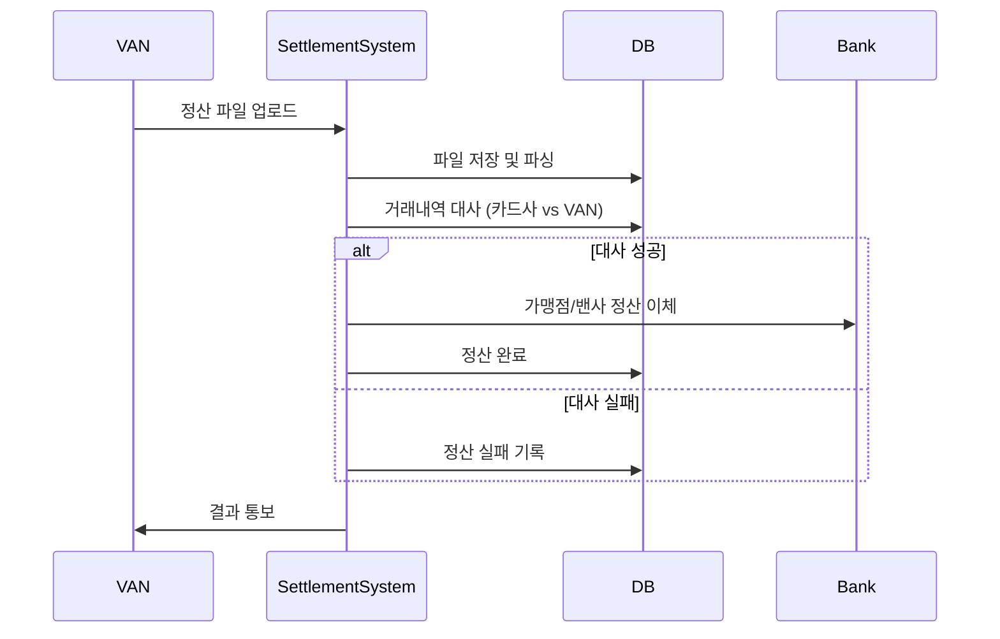
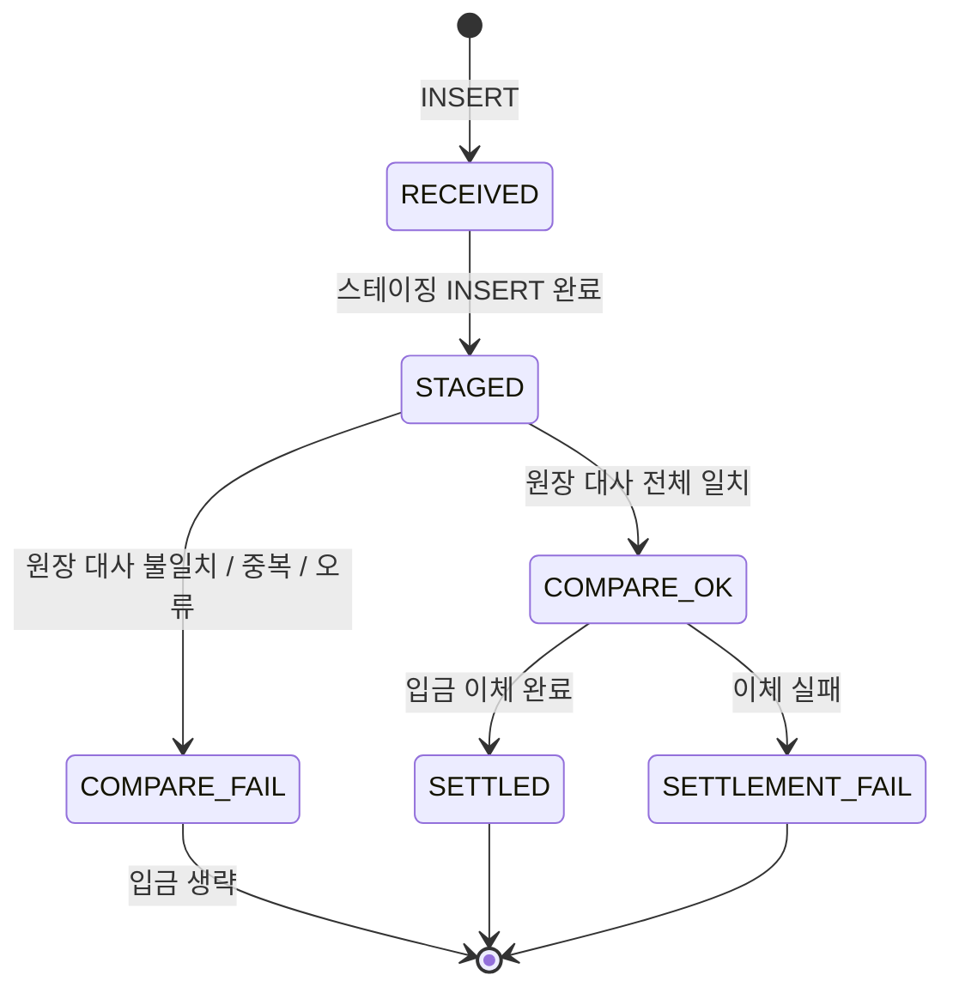

## 💸Settlement-Service

> VAN이 전송한 정산용 CSV를 수신하고, 원장(Replica DB) 대사 → 은행 이체 → VAN SSE 알림을 처리합니다.

---

## 목차

1. [개요](#1-개요)
2. [기술 스택](#2-기술-스택)
3. [아키텍처 / 전체 흐름](#3-아키텍처--전체-흐름)
4. [API 명세](#4-api-명세)
5. [처리 단계](#5-처리-단계)
6. [데이터베이스](#6-데이터베이스)
7. [기술적 고려사항](#7-기술적-고려사항)
8. [현재 시스템의 한계 및 보완점](#8-현재-시스템의-한계-및-보완점)
9. [빌드 & 실행](#9-빌드--실행)

---

## 1. 개요

`settlement-service`는 카드 결제 정산 서비스의 카드 로직 입니다..

### 역할

| 단계 | 내용 |
|------|------|
| 수신 | VAN으로부터 정산 CSV 파일을 HTTP multipart로 수신 |
| 스테이징 | 파일을 저장하고 shared DB에 행 단위로 적재 |
| 원장 대사 | 스테이징 데이터를 원장 데이터 (ledger_replica의 `card_ledger`)와 비교 |
| 정산 입금 | 대사 성공 시 가맹점/VAN에게 banking-service를 통해 이체 |
| 알림 | 처리 결과를 VAN 서버에 전달 (SSE) |

### 연동 서비스

```
VAN 서버 ──POST CSV──▶ settlement-service ──POST /api/bank/transfer──▶ banking-service
                                │
                                └──POST /api/van/sse/batch-result──▶ VAN 서버 (SSE 트리거)
```

| 서비스 | 연동 목적 |
|--------|-----------|
| `banking-service` (`:8083`) | 가맹점·VAN 계좌로 이체 실행 |
| `van` | 배치 처리 결과 알림 (SSE) |

---

## 2. 기술 스택

| 항목 | 내용 |
|------|------|
| Language | Java 17 |
| Framework | Spring Boot 3.5 |
| Build | Gradle |
| DB 접근 | Spring JDBC |
| DB | MySQL 8 × 2개 (shared_master, ledger_replica) |
| HTTP Client | `RestClient` |
| Service Discovery | Spring Cloud Netflix Eureka Client |
| 기타 | Lombok, `@Async` |

---

## 3. 아키텍처 / 전체 흐름



### 동기 vs 비동기 구간

| 구간 | 처리 방식 | 내용 |
|------|-----------|------|
| HTTP 요청 수신 ~ 스테이징 완료 | **동기** | VAN에 즉시 200 응답 반환 |
| 원장 대사 → 입금 → VAN 알림 | **비동기 (`@Async`)** | 별도 스레드 풀에서 실행 |

---

## 4. API 명세

### `POST /api/settlement/upload`

VAN 서버에서 정산 CSV를 업로드하는 엔드포인트입니다.

**Request**

| 항목 | 값 |
|------|----|
| Method | `POST` |
| URL | `/api/settlement/upload` |
| Content-Type | `multipart/form-data` |

| 파라미터 | 타입 | 필수 | 설명 |
|----------|------|------|------|
| `file` | `MultipartFile` | ✅ | 정산 CSV 파일 (`.csv` 확장자만 허용) |
| `batchDate` | `String` | ✅ | 정산 배치 날짜 (`yyyy-MM-dd` 형식) |


**Response — 성공 (200)**

```json
{
  "fileName": "settlement_20240101.csv",
  "message": "CSV 파일 수신 및 정산 처리가 시작되었습니다.",
  "status": "SUCCESS"
}
```

> 여기서의 응답은 CSV 파일을 잘 받았음을 의미합니다. 정산 결과는 뒤에 전달됩니다.

**Response — 실패 (400) 또는 서버 오류 (500)**

```json
{
  "status": "FAIL",
  "message": ",,,,,,"
}
```

---

## 5. 처리 단계

### 1️⃣ [동기] 파일 수신 및 스테이징 (Phase 1)

사용자의 업로드 요청에 대해 최소한의 데이터 안전성만 확보하고 즉시 응답하는 구간입니다.

- 진입점: SettlementController (POST /api/settlement/upload)

- 물리 저장: file.transferTo()를 통해 디스크에 저장 (UUID를 통한 파일명 충돌 방지).

- DB 기록: van_settlement_file에 메타데이터 기록 (상태: RECEIVED).

- Staging 적재: CSV를 파싱하여 van_settlement_staging 테이블에 Bulk Insert (batchUpdate).

- 상태 전이: 모든 적재가 완료되면 상태를 STAGED로 변경 후 200 OK 응답.

### 2️⃣ [비동기] 원장 대사 (Phase 2: Reconciliation)

@Async를 통해 백그라운드에서 실행되며, 데이터의 정합성을 검증하는 핵심 단계입니다.

- 데이터 로드: file_id를 기준으로 스테이징 데이터 전체 로드.
- 원장 매칭: (RRN, STAN)을 복합 키로 사용하여 Replica DB(card_ledger)에서 대조군 조회.
- 검증 로직: Application Map 방식 사용: 모든 데이터를 메모리에 올려 $O(1)$ 속도로 체크.
- 체크 항목: 원장 존재 여부, 금액 일치, 가맹점 ID 일치, 승인번호 일치, 카드번호 마스킹 대조.
- 결과: 일치 시 COMPARE_OK, 불일치 시 COMPARE_FAILED.

### 3️⃣ [비동기] 수수료 계산 및 입금 (Phase 3: Payout)

대사가 성공한 건에 한해 실제 금전적 이동을 처리합니다.

- 실행 조건: 파일 상태가 반드시 COMPARE_OK여야 함.
- 수수료 산식:가맹점 몫: $금액 - (금액 \times 수수료율)$
- VAN사 지분: $수수료 \div 2$
- 뱅킹 연동: BankTransferClient를 통해 외부 Banking-Service 호출.
- 상태 전이: 전체 루프 성공 시 SETTLED, 도중 실패 시 SETTLEMENT_FAIL.

*이체 흐름*

```
카드사 계좌 (9000-0001)
    │
    ├──▶ 가맹점 정산 계좌 (merchant_master.settle_account):  merchantPay 원
    │
    └──▶ VAN 계좌 (9000-0002):  vanShare 원
```

### 4️⃣ [비동기] 최종 결과 알림 (Phase 4: Notification)

모든 정산 결과를 VAN사에 Push하여 실시간 사용자 알림(SSE)을 유도합니다.

- 알림 전송: VanBatchResultNotifier가 VAN API 서버로 POST 요청.
- 상태 코드 매핑 (buildDto):
  - 대사 실패 → COMPARE_FAILED
  - 입금 성공 → SUCCESS
  - 입금 실패 및 기타 예외 → SETTLEMENT_FAILED

---

## 6. 데이터베이스

### 사용 DB 목록

| DB 이름 | 용도 | 트랜잭션 매니저 |
|---------|------|----------------|
| `shared_master` | 정산 파일 추적, 스테이징, 가맹점 정보 | `sharedTransactionManager` |
| `ledger_replica` | 원장 대사 기준 데이터 (Read-Only) | `replicaTransactionManager` (@Primary) |

---

### shared_master — `van_settlement_file`

#### `status` 상태 전이



| 상태 | 의미 |
|------|------|
| `RECEIVED` | 파일 받은 직후 |
| `STAGED` | CSV 행 전체 스테이징 완료 |
| `COMPARE_OK` | 원장 대사 일치 |
| `COMPARE_FAIL` | 원장 대사 실패 |
| `SETTLED` | 입금 이체까지 완료 |
| `SETTLEMENT_FAIL` | 대사 성공 후 이체 실패 |

---

## 7. 고려사항

### Reconciliation(대사) 방식 비교

현재 시스템에서 대사를 처리하는 세 가지 방식에 대한 비교입니다.

| 구분 | Application Map (현재) | DB Level Join | Chunk (Spring Batch) |
| :--- | :--- | :--- | :--- |
| **특징** | 자바 메모리에서 전수 비교 | SQL JOIN 활용 | N건씩 끊어서 처리 |
| **장점** | 비즈니스 로직(마스킹 등) 구현 자유 | 데이터 이동 최소화, 안정성 확보 | 안정성 끝판왕, 메모리 사용량 고정 |
| **단점** | 데이터 대량 유입 시 OOM 위험 | DB간 서버 분리 시 조인 불가 | 전체 처리 속도가 상대적으로 느림 |
| **적합성** | 5만 건 이하 (현재 규모) | 수십만 건 이상 (동일 DB일 때) | 수백만 건 이상 대규모 정산 |

> [!NOTE]  
> 현재 선정 방식: Application Map
> 현재 `ledger_replica`와 `shared_master`(staging)가 물리적으로 서로 다른 데이터베이스 서버에 존재하기 때문에 SQL 수준의 `DB Level Join`은 어렵습니다. ( DB 링크, 임시 테이블 활용, 데이터 가상화 등의 방법이 필요)

---

## 8. 현재 시스템의 한계 및 보완점

🔴 멱등성(Idempotency) 부재
- 현상: 동일 파일 재업로드 시 별도의 중복 체크 없이 새 fileId로 정산이 재시도됨.
- 위험: 중복 입금 사고 발생 가능성.
- 보안: file_name에 UNIQUE 제약 조건을 추가하거나 업로드 전 상태 조회 로직 추가 필요.

🟡 부분 이체 롤백 불가
- 현상: 가맹점 루프 이체 중 에러 발생 시, 이전 성공 건은 롤백되지 않음.
- 위험: 재시도 시 성공한 가맹점에게 이중 입금 위험.
- 보안: staging 테이블에 payout_yn 플래그를 추가하여 성공 건은 Skip하도록 개선 필요.

=> **Spring Batch** 도입의 필요성

| 현재 시스템 한계 | Spring Batch 해결 방식 |
| :--- | :--- |
| 메모리 부족 (OOM) | Chunk 지향 처리: 일정 단위(Chunk)로 끊어 읽어 메모리 점유율 고정 |
| 부분 실패/롤백 불가 | Skip & Retry: 실패 건만 건너뛰거나 다시 시도하는 정책 내장 |
| 중복 실행 위험 | JobInstance 관리: 성공한 파라미터(날짜/파일명)의 중복 실행 원천 차단 |
| 상태 추적 번거로움 | Meta-Table: 처리 건수, 실행 시간, 성공 여부 자동 기록 및 관리 |

---

## 9. 빌드 & 실행

### 로컬 실행

```bash
# 빌드
./gradlew build

# 실행 (기본 포트: 8084)
./gradlew bootRun

# 환경 변수 지정 실행 예시
DB_REPLICA_URL=jdbc:mysql://localhost:3313/ledger_replica?allowPublicKeyRetrieval=true&useSSL=false \
DB_SHARED_URL=jdbc:mysql://localhost:3312/shared_master?allowPublicKeyRetrieval=true&useSSL=false \
DB_PASSWORD=1234 \
./gradlew bootRun
```

### Docker 실행

```dockerfile
# Dockerfile 기준
FROM eclipse-temurin:17-jre
COPY build/libs/*.jar app.jar
ENTRYPOINT ["java", "-jar", "/app.jar"]
```

```bash
# 빌드
docker build -t settlement-service .

# 실행
docker run -p 8084:8084 \
  -e DB_REPLICA_URL=jdbc:mysql://host.docker.internal:3313/ledger_replica?allowPublicKeyRetrieval=true&useSSL=false \
  -e DB_SHARED_URL=jdbc:mysql://host.docker.internal:3312/shared_master?allowPublicKeyRetrieval=true&useSSL=false \
  -e DB_PASSWORD=1234 \
  -e SETTLEMENT_VAN_TEMP_DIR=/var/van-uploads \
  -e SETTLEMENT_CARD_COMPANY_ACCOUNT=9000-0001 \
  -e SETTLEMENT_VAN_ACCOUNT=9000-0002 \
  settlement-service
```
